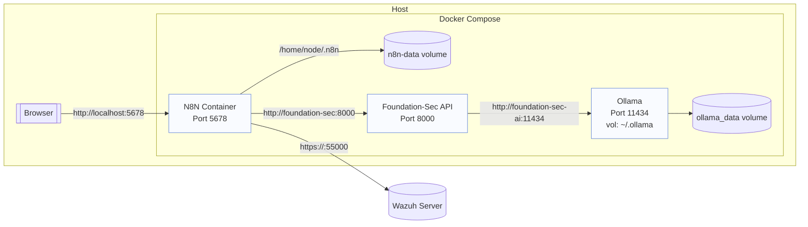
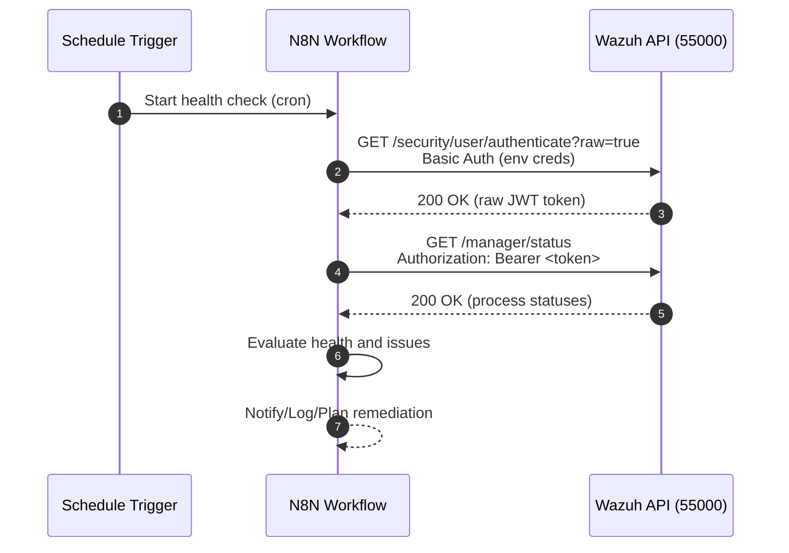
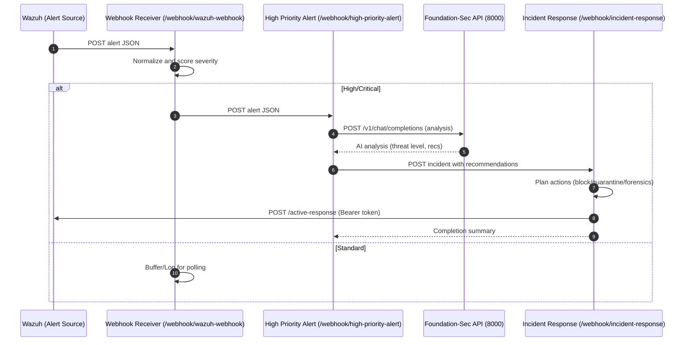
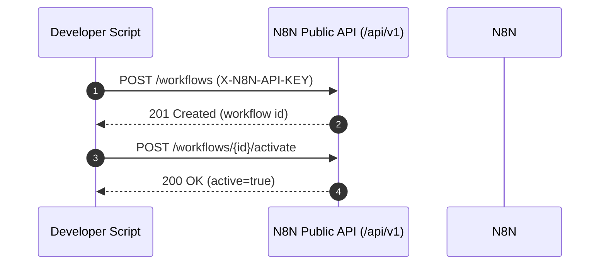

# N8N-Sec Project Architecture

This document provides a visual overview of the project’s components, deployment topology, and key data flows between services and workflows. Diagrams use Mermaid so you can preview them in most IDEs.

## Components Overview

```mermaid
graph TD
  U[Admin/User] -->|Basic Auth| N8N[N8N UI + Workflows (5678)]

  subgraph Docker Network: n8n-network
    N8N -->|HTTP POST (JSON)| FS[Foundation-Sec API (FastAPI) (8000)]
    FS -->|HTTP JSON| OLL[Ollama (LLM Backend) (11434)]
    N8N -->|HTTPS (Bearer Token)| WAZ[Wazuh API (55000)]
  end

  N8N -.->|Public API /api/v1 (X-N8N-API-KEY)| N8NAPI[(N8N Public API)]

  subgraph Workflows
    A1[Webhook Receiver /webhook/wazuh-webhook]
    A2[High Priority Alert /webhook/high-priority-alert]
    A3[Incident Response /webhook/incident-response]
    A4[Auth Bridge /webhook/bridge-auth]
    A5[AI Chat /webhook/chat]
    A6[Alert Monitoring (cron)]
    A7[Health Monitoring (cron)]
  end

  N8N --- A1 & A2 & A3 & A4 & A5 & A6 & A7

  classDef svc fill:#e8f0fe,stroke:#4a67d6,stroke-width:1px;
  classDef wf fill:#eef7ee,stroke:#45a049,stroke-width:1px;
  class N8N,FS,OLL,WAZ,N8NAPI svc;
  class A1,A2,A3,A4,A5,A6,A7 wf;
```

## Deployment Topology



## Sequence: Wazuh Token + Health Check



## Sequence: Real-time Alert to High Priority AI Analysis



## Sequence: Public API Import/Activate



## Key Configuration

- N8N Public API: `X-N8N-API-KEY` via `N8N_API_TOKEN`
- N8N Base URL: `N8N_SERVER` (default `http://localhost:5678`)
- Wazuh API: `WAZUH_API_URL`, `WAZUH_API_USER`, `WAZUH_API_PASSWORD`
- SSL: Self-signed allowed in workflows (development); prefer trusted CA in production
- Docker network: `n8n-network` connects all containers

## Notes

- Token flow: Use Basic Auth only for `/security/user/authenticate?raw=true`, then Bearer token for protected endpoints like `/manager/status`, `/manager/info`, `/agents`, etc.
- Alert monitoring via indexer is optional; ensure `WAZUH_INDEXER_URL` is reachable before enabling related nodes.
- Public API standardization: scripts use `/api/v1` exclusively with `N8N_API_TOKEN`.

