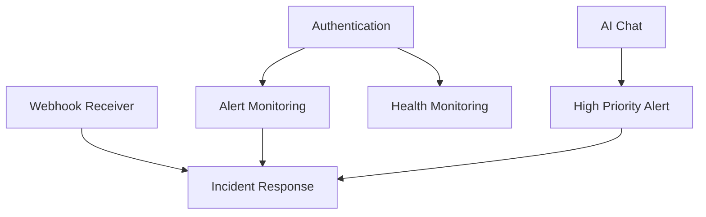

# N8N Security Workflows Documentation

## 📋 Overview

This document provides comprehensive documentation for all n8n security workflows in the platform. Each workflow is designed for defensive cybersecurity operations including threat detection, alert processing, and automated incident response.

## 🔄 Workflow Architecture

The platform consists of 7 interconnected workflows that handle different aspects of security monitoring and response:

```
┌─────────────────┐    ┌──────────────────┐    ┌─────────────────┐
│  Real-time      │    │   Scheduled      │    │   AI-Powered    │
│  Processing     │    │   Monitoring     │    │   Analysis      │
├─────────────────┤    ├──────────────────┤    ├─────────────────┤
│ Webhook         │    │ Alert Monitoring │    │ High Priority   │
│ Receiver        │    │ Health Checks    │    │ Alert Analysis  │
│ Authentication  │    │ API Polling      │    │ AI Chat         │
└─────────────────┘    └──────────────────┘    └─────────────────┘
         │                       │                       │
         └───────────────────────┼───────────────────────┘
                                 │
                    ┌─────────────────┐
                    │ Incident        │
                    │ Response        │
                    │ Automation      │
                    └─────────────────┘
```

## 📝 Workflow Details

### 1. Webhook Receiver Workflow
**File**: `workflows/webhook-receiver-workflow.json`  
**Purpose**: Real-time security alert ingestion from Wazuh SIEM

#### Configuration
- **Webhook URL**: `/webhook/wazuh-alerts`
- **Method**: POST
- **Content-Type**: application/json

#### Processing Flow
1. **Alert Reception** - Receives raw Wazuh alerts
2. **Data Normalization** - Standardizes alert format
3. **Severity Classification** - Categorizes alerts (low/medium/high/critical)
4. **Routing Logic** - Directs alerts to appropriate handlers
5. **Slack Notifications** - Sends formatted notifications for medium+ alerts

#### Sample Input
```json
{
  "id": "1234567890.12345",
  "rule": {
    "level": 8,
    "description": "Multiple authentication failures",
    "id": "5710"
  },
  "agent": {
    "name": "web-server-01",
    "ip": "192.168.1.100"
  },
  "timestamp": "2025-08-28T12:00:00.000Z",
  "location": "/var/log/auth.log",
  "full_log": "Failed password for user from 192.168.1.200"
}
```

#### Alert Severity Mapping
- **Level 1-3**: Informational (buffered)
- **Level 4-6**: Low priority (logged)
- **Level 7-9**: Medium priority (Slack notification)
- **Level 10+**: High priority (AI analysis + incident response)

---

### 2. High Priority Alert Workflow
**File**: `workflows/high-priority-alert-workflow.json`  
**Purpose**: AI-powered analysis of critical security alerts

#### Configuration
- **Webhook URL**: `/webhook/high-priority-alert`
- **AI Integration**: Foundation-Sec model via tinyllama
- **Timeout**: 60 seconds for AI analysis

#### Processing Flow
1. **Alert Validation** - Ensures required fields present
2. **Context Enrichment** - Adds threat intelligence data
3. **AI Analysis Request** - Submits to Foundation-Sec AI
4. **Threat Assessment** - Processes AI response
5. **Response Planning** - Determines automated actions
6. **Escalation Logic** - Routes to incident response if critical

#### AI Analysis Prompt Template
```
Analyze this high-priority security alert:

Rule: {rule_description}
Severity Level: {rule_level}
Agent: {agent_name}
Source IP: {agent_ip}
Full Log: {full_log}

Provide threat assessment, potential impact, and recommended response actions.
```

#### Response Categories
- **Informational**: Log and monitor
- **Low Risk**: Standard notification
- **Medium Risk**: Enhanced monitoring + notification
- **High Risk**: Automated response + human review
- **Critical**: Immediate response + escalation

---

### 3. Wazuh Authentication Workflow
**File**: `workflows/wazuh-authentication-workflow.json`  
**Purpose**: Secure authentication with Wazuh API and token management

#### Configuration
- **Webhook URL**: `/webhook/bridge-auth`
- **Authentication Method**: Basic Auth with environment variables
- **Token Validity**: Configurable (typically 15-60 minutes)

#### Environment Variables Required
```bash
WAZUH_API_URL=https://172.20.18.14:55000
WAZUH_API_USER=wazuh
WAZUH_API_PASSWORD=your_secure_password
```

#### Processing Flow
1. **Request Validation** - Validates incoming auth requests
2. **Credential Retrieval** - Gets credentials from environment
3. **API Authentication** - Authenticates with Wazuh API
4. **Token Extraction** - Extracts JWT token from response
5. **Token Validation** - Verifies token format and length
6. **Response Formatting** - Returns structured auth response

#### Response Format
```json
{
  "success": true,
  "message": "Successfully authenticated with Wazuh API",
  "wazuh_server": "https://172.20.18.14:55000",
  "authenticated_at": "2025-08-28T12:00:00.000Z",
  "token": "eyJhbGciOiJFUzUxMiIsInR5cCI6IkpXVCJ9..."
}
```

---

### 4. Alert Monitoring Workflow
**File**: `workflows/wazuh-alert-monitoring-workflow.json`  
**Purpose**: Scheduled polling of Wazuh API for security alerts

#### Configuration
- **Schedule**: Every 2 minutes (configurable)
- **Timeout**: 30 seconds per API call
- **Retry Logic**: 2 retries with 1-second intervals

#### Processing Flow
1. **Health Check** - Validates Wazuh API availability
2. **Token Acquisition** - Gets authentication token
3. **Alert Retrieval** - Fetches recent alerts from Wazuh
4. **Data Processing** - Filters and formats alert data
5. **Batch Processing** - Handles multiple alerts efficiently
6. **Error Handling** - Manages API failures gracefully

#### Query Parameters
- **Time Range**: Last 2 minutes (adjustable)
- **Alert Levels**: Configurable minimum level
- **Agent Filters**: Optional agent-specific monitoring
- **Rule Filters**: Optional rule-based filtering

#### Error Recovery
- **Connection Timeout**: Retry with exponential backoff
- **Authentication Failure**: Token refresh and retry
- **Rate Limiting**: Respect API rate limits
- **Service Unavailable**: Alert operations team

---

### 5. Health Monitoring Workflow
**File**: `workflows/wazuh-health-monitoring-workflow.json`  
**Purpose**: Comprehensive health monitoring of Wazuh infrastructure

#### Configuration
- **Schedule**: Every 5 minutes
- **Monitoring Scope**: API, Manager, Cluster status
- **Alert Thresholds**: Configurable performance metrics

#### Monitoring Components
1. **API Health** - Endpoint availability and response time
2. **Manager Status** - Wazuh manager service health
3. **Cluster Status** - Multi-node cluster coordination
4. **Performance Metrics** - Response times and throughput
5. **Resource Usage** - Memory and CPU utilization

#### Health Status Levels
- **Healthy**: All systems operational
- **Warning**: Performance degradation detected
- **Degraded**: Partial functionality affected
- **Critical**: Major system issues requiring immediate attention

#### Automated Remediation
```javascript
// Example remediation actions
const remediationActions = {
  api_unavailable: "check_network_connectivity",
  manager_stopped: "restart_wazuh_manager",
  cluster_issues: "check_cluster_status",
  high_latency: "performance_optimization"
};
```

---

### 6. Incident Response Workflow
**File**: `workflows/wazuh-incident-response-workflow.json`  
**Purpose**: Automated security incident response and containment

#### Configuration
- **Webhook URL**: `/webhook/incident-response`
- **Response Types**: Blocking, quarantine, forensics collection
- **Escalation Rules**: Based on threat level and impact

#### Response Actions
1. **IP Blocking** - Automatic firewall rule creation
2. **Host Quarantine** - Network isolation of affected systems
3. **Forensics Collection** - Automated evidence gathering
4. **Notification Dispatch** - Multi-channel alerting
5. **Ticket Creation** - Integration with ITSM systems

#### Response Planning Logic
```javascript
// Automated response decision matrix
const responsePlan = {
  threat_level: "high",
  actions: {
    block_ip: severity >= 8,
    quarantine_host: severity >= 10,
    collect_forensics: severity >= 12,
    notify_soc: severity >= 8,
    escalate_management: severity >= 15
  }
};
```

#### Integration Points
- **Firewall APIs**: For IP blocking
- **EDR Systems**: For host quarantine
- **SIEM Integration**: For forensics data
- **Communication Platforms**: Slack, Teams, email
- **Ticketing Systems**: ServiceNow, Jira

---

### 7. AI Chat Workflow
**File**: `workflows/ai-chat-workflow.json`  
**Purpose**: Interactive AI-powered security analysis and consultation

#### Configuration
- **Webhook URL**: `/webhook/chat`
- **AI Model**: Foundation-Sec via tinyllama (memory optimized)
- **Context Window**: 2048 tokens
- **Response Limit**: 256 tokens

#### Use Cases
1. **Threat Analysis** - Interactive threat assessment
2. **Incident Investigation** - AI-assisted forensics
3. **Security Consultation** - Best practice recommendations
4. **Alert Interpretation** - Natural language alert explanation
5. **Response Guidance** - Step-by-step incident response

#### Sample Interaction
```json
// Input
{
  "messages": [
    {
      "role": "user", 
      "content": "Analyze this security alert: Multiple failed SSH attempts from IP 192.168.1.200 targeting user 'admin' on web-server-01"
    }
  ]
}

// Response
{
  "analysis": "This appears to be a brute force attack against SSH...",
  "threat_level": "medium",
  "recommendations": [
    "Block source IP immediately",
    "Review authentication logs",
    "Implement account lockout policies"
  ]
}
```

## 🔧 Configuration Management

### Environment Variables
All workflows use standardized environment variables:

```bash
# Wazuh Configuration
WAZUH_API_URL=https://172.20.18.14:55000
WAZUH_API_USER=wazuh
WAZUH_API_PASSWORD=secure_password

# AI Configuration  
OLLAMA_URL=http://foundation-sec-ai:11434
FOUNDATION_SEC_MODEL=tinyllama

# Notification Configuration
SLACK_WEBHOOK_URL=https://hooks.slack.com/services/YOUR/WEBHOOK/URL
TEAMS_WEBHOOK_URL=https://your-org.webhook.office.com/webhook2/YOUR/URL

# Security Configuration
SSL_VERIFY=false  # For internal Wazuh server with self-signed certs
API_TIMEOUT=30    # Default API timeout in seconds
```

### Workflow Dependencies


## 🧪 Testing and Validation

### Individual Workflow Testing
Each workflow can be tested independently using curl commands:

```bash
# Test webhook receiver
curl -X POST http://localhost:5678/webhook/wazuh-alerts \
  -H "Content-Type: application/json" \
  -d @test-alert.json

# Test high priority alert
curl -X POST http://localhost:5678/webhook/high-priority-alert \
  -H "Content-Type: application/json" \
  -d @critical-alert.json

# Test authentication
curl -X POST http://localhost:5678/webhook/bridge-auth \
  -H "Content-Type: application/json" \
  -d '{"username":"test","password":"test"}'
```

### Integration Testing
Run the comprehensive test suite:

```bash
python3 scripts/test-wazuh-integration.py
```

## 🔒 Security Considerations

### Authentication Security
- **Environment Variables**: Credentials stored securely
- **Token Management**: JWT tokens with appropriate expiration
- **SSL/TLS**: Encrypted communication where possible
- **Input Validation**: Comprehensive input sanitization

### Data Protection
- **Sensitive Data**: PII and credentials properly masked in logs
- **Audit Trail**: All security actions logged with timestamps
- **Retention Policy**: Alert data retention per compliance requirements
- **Access Control**: Role-based access to workflows and data

### Network Security
- **Firewall Rules**: Appropriate network segmentation
- **Certificate Management**: Proper SSL certificate handling
- **API Security**: Rate limiting and authentication
- **Monitoring**: Network traffic analysis for anomalies

## 📊 Performance and Monitoring

### Workflow Metrics
- **Execution Time**: Average workflow completion time
- **Success Rate**: Percentage of successful executions
- **Error Rate**: Failed executions and error types
- **Throughput**: Alerts processed per minute/hour
- **Resource Usage**: Memory and CPU utilization

### Health Indicators
- **API Response Time**: Wazuh API latency monitoring
- **Alert Processing Lag**: Time from alert generation to processing
- **AI Analysis Time**: Foundation-Sec model response time
- **Notification Delivery**: Success rate of alert notifications
- **System Availability**: Overall platform uptime

## 🚀 Deployment and Maintenance

### Workflow Import Process
1. Access n8n at `http://localhost:5678`
2. Navigate to workflow import section
3. Import each JSON file from `workflows/` directory
4. Configure environment variables and credentials
5. Test each workflow individually
6. Activate workflows for production use

### Maintenance Tasks
- **Regular Testing**: Weekly workflow validation
- **Performance Review**: Monthly performance analysis
- **Security Updates**: Quarterly security review
- **Documentation Updates**: Keep workflows and docs in sync
- **Backup Procedures**: Regular workflow configuration backup

### Troubleshooting
Common issues and resolutions are documented in `docs/troubleshooting-guide.md`.

---

**Document Version**: 1.0  
**Last Updated**: August 28, 2025  
**Status**: Production Ready  
**Review Cycle**: Monthly